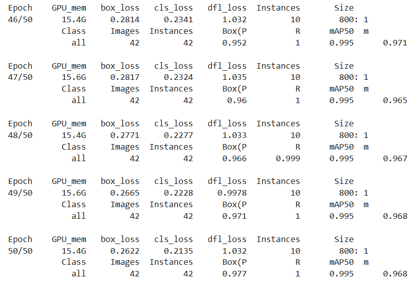
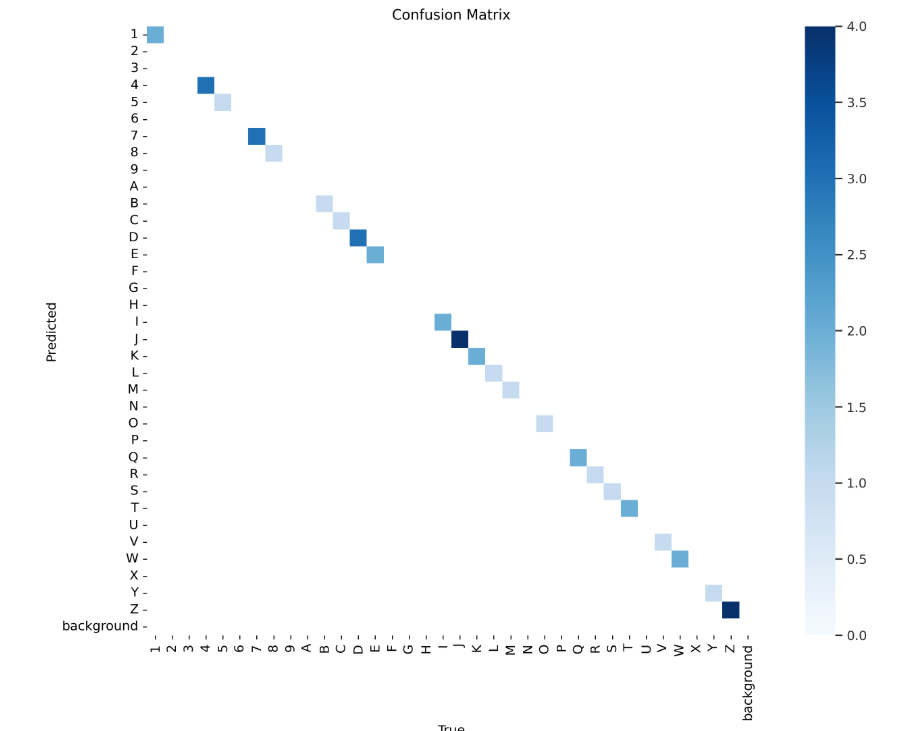
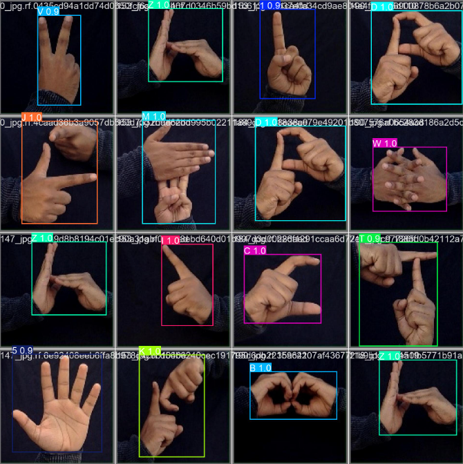

### YOLO Sign Language
With the help of Yolov8 and Concolutional Neural Network, I have created a machine learning model that detects and indicates the words shown by the user who is speaking in sign language. The training dataset has been annotated and obtained from Roboflow, and the model has an accuracy of over 97%. 

### Epoch Training

  

### Confusion Matrix
 
 
### Output Test Data
 
